# Energy Cost Required for Mining a Single Bitcoin   - Historical Analysis and Future Projections

This study analyzes the energy costs of mining a single Bitcoin using historical data from 2009-2025 and projects future trends through 2028. By leveraging electricity consumption as a fundamental physical metric, we establish a tangible basis for calculating Bitcoin's production cost floor. This approach facilitates an exploration of how fluctuations in energy markets and physical constraints could influence mining profitability thresholds, providing a clearer perspective on the sustainability and economic viability of Bitcoin mining operations.

We normalize energy prices using the Consumer Price Index (CPI) to isolate inflation from actual energy cost trends. We examine the evolution of mining hardware efficiency, measured in Joules per Terahash (J/TH), highlighting the transition from CPU and GPU mining to the adoption of specialized ASIC hardware. This progression underscores the significant improvements in energy efficiency over time.

Furthermore, we analyze the implications of Bitcoin's production cost—primarily energy consumption and hardware expenses—on its market price. The study considers scenarios where prolonged periods of unprofitable mining could lead to miner attrition, subsequently affecting the global hashrate and mining difficulty. Such dynamics are crucial for understanding the potential "floor" price of Bitcoin and the broader economic factors influencing the cryptocurrency's valuation.

### Authors & Code:
This is [https://energycostmodel.com/](https://energycostmodel.com/)
is a work in progress. We are continuously updating and improving the model, and we welcome any feedback or suggestions you may have. Please feel free to reach out to us with your thoughts or ideas.

* [The Hyperlabs](https://thehyperlabs.com)  - Those who build on Bitcoin, sculpt the currency of the future.
* [Contact](./contact/) - Drop us a message
* [Code](https://github.com/EnergyCostModel/model) - Model is open-sourced on GitHub
* [PDF](./index.pdf) - Download the PDF version of this analysis

|Release Date | Note|
|:--------------------|:-------------------------------------|
|21 Mar 2025  | Initial Version |
|25 Mar 2025  | S2F |
|26 Mar 2025  | Price Channels |
|18 Apr 2025  | Data Update |
|27 Apr 2025  | Data Update |
|4 May 2025  | Data Update |
|17 May 2025  | Daily frequency sampling|
|22 May 2025  | Data Update |
|6 Jun 2025  | Data Update |
|12 Jun 2025  | Data Update |
|10 Jul 2025  | Antminer S21 XP - 13.5 J/TH + Gaussian weights on rolling efficiency |
|18 Jul 2025  | Data Update |
|2 Aug 2025  | Data Update |
|5 Sep 2025  | Educational restructuring with FreeYoda feedback |

**Please note that this analysis is for educational purposes only and should never be treated as financial advice.**

# Introduction: Understanding Bitcoin Through Energy

## A Simple Question With Profound Implications

Have you ever wondered what gives Bitcoin its value? Unlike gold which has industrial uses, or currencies backed by governments, Bitcoin seems to exist purely in the digital realm. Yet it trades for tens of thousands of dollars. Why?

The answer lies in energy—specifically, the electricity required to create new Bitcoins through a process called mining. Every Bitcoin in existence required real-world energy to produce, creating a fascinating economic dynamic that this analysis explores.

## What You'll Learn

In this educational analysis, we'll explore:
1. **How Bitcoin mining works** - The basics of converting electricity into digital currency
2. **The evolution of mining technology** - From home computers to warehouse-scale operations
3. **The economics of production costs** - Why energy creates a price floor for Bitcoin
4. **Historical patterns and future projections** - What the data tells us about Bitcoin's relationship with energy

## The Energy-Value Connection

Here's a simple concept that unlocks Bitcoin economics: **It costs real money (in electricity) to mine Bitcoin**. 

Imagine you run a gold mine. If it costs you $1,500 to extract an ounce of gold, you won't sell it for $1,200—you'd lose money. The same logic applies to Bitcoin mining. If it costs $30,000 in electricity to mine one Bitcoin, that creates a natural price floor. Miners won't continue operating at a loss indefinitely.

This relationship between energy costs and Bitcoin's price isn't just theoretical—it's observable in the data. During market crashes, Bitcoin's price often finds support near the average cost of production. When prices soar far above production costs, we often see speculative bubbles that eventually correct.

## Our Analytical Framework

This study presents a data-driven framework for understanding Bitcoin's value through the lens of energy economics. We calculate the electricity cost to mine a single Bitcoin and track how this metric has evolved since 2009. 

**Important Note**: This is an educational analysis, not financial advice. We're exploring economic relationships to understand how Bitcoin works, not predicting future prices.

Bitcoin's price is sometimes thought of as having a "floor" determined by its cost of production—primarily energy consumption and miner hardware costs. The logic goes:
* Miners expend substantial resources (energy + hardware costs) to produce new bitcoins.
* If bitcoin’s price remains below this "production cost" for an extended period, miners become unprofitable.
* Unprofitable miners exit, causing bankruptcies.
* Such bankruptcies, the argument goes, eventually constrain the global hashrate of bitcoin miners and its energy cost per bitcoin, as the difficulty of mining adjusts downward.

## Chapter 1: The Evolution of Mining Technology

### What Is Bitcoin Mining?

Before we dive into efficiency metrics, let's understand what mining actually does. Bitcoin miners aren't digging for digital gold—they're solving complex mathematical puzzles. Think of it like a global lottery where:
- Miners compete to solve a cryptographic puzzle first
- The winner gets to add the next block of transactions to the blockchain
- As a reward, they receive newly created Bitcoin plus transaction fees
- This process repeats approximately every 10 minutes

The "work" in mining is computational—trillions of calculations per second, each consuming electricity.

### Why Efficiency Matters: The Economics of Mining

Mining efficiency determines profitability. It answers a simple question: **How much electricity does it take to perform one trillion hash calculations?**

This is measured in **Joules per Terahash (J/TH)**:
- **Joules** = units of energy (like watts × seconds)
- **Terahash** = one trillion (1,000,000,000,000) hash calculations
- **Lower J/TH** = more efficient = less electricity cost per calculation

### The Remarkable Journey From CPUs to ASICs

The evolution of mining hardware tells a story of exponential improvement driven by economic incentives. As Bitcoin's value rose, so did the rewards for developing better mining technology.

**Phase 1: The Hobbyist Era (2009-2010)**
In Bitcoin's infancy, anyone with a computer could mine. Your laptop's CPU could earn Bitcoin while you slept. But CPUs were incredibly inefficient—consuming massive amounts of power for minimal computational output.

**Phase 2: The GPU Revolution (2010-2011)**  
Miners discovered that graphics cards, designed for parallel processing in video games, excelled at Bitcoin's repetitive calculations. A single GPU could outperform dozens of CPUs while using less total power.

**Phase 3: The FPGA Transition (2011-2013)**
Field-Programmable Gate Arrays offered better efficiency than GPUs but required technical expertise to program and operate. This marked the shift from hobbyist to professional mining.

**Phase 4: The ASIC Dominance (2013-Present)**
Application-Specific Integrated Circuits changed everything. These chips do one thing only—mine Bitcoin—but they do it extraordinarily well. Modern ASICs are literally millions of times more efficient than the CPUs of 2009. 

### The Numbers That Tell the Story

Let's look at actual efficiency improvements over time. The following table shows how dramatically mining technology has evolved:

| Release Date        | Miner Hardware (Manufacturer)        |   Efficiency (J/TH) | Reference |
|:--------------------|:-------------------------------------|--------------------:|:-------------------------------------|
| 2009-01-01 | CPU Mining (Intel Core i5-650)       |         5000000     | ([Bitcoin Mining Efficiency: The Road From 5,000,000 to 5 J/TH (And Beyond)](https://www.bitdeer.com/news/bitcoin-mining-efficiency-the-road-from-5000000-to-5-jth-and-beyond#:~:text=In%20the%20first%20five%20years,in%20mining%20efficiency%20and%20technology)) |
| 2010-10-01 | GPU – ATI Radeon HD 5870 (ATI)       |          264550     |([The Future of Bitcoin Mining Efficiency: A Deep Dive into ASIC Evolution - D-Central](https://d-central.tech/the-future-of-bitcoin-mining-efficiency-a-deep-dive-into-asic-evolution/#:~:text=Hardware%20Type%20Hardware%20Name%20Manufacturer,Not%20Available%20Not%20Available%20877%2C193)) |
| 2011-08-01 | FPGA – X6500 Miner (FPGA Mining LLC) |           43000     |([The Future of Bitcoin Mining Efficiency: A Deep Dive into ASIC Evolution - D-Central](https://d-central.tech/the-future-of-bitcoin-mining-efficiency-a-deep-dive-into-asic-evolution/#:~:text=GPU%20ATI%205870M%20ATI%20Technologies,6%202%201%2C250)) |
| 2013-01-01 | ASIC – AvalonMiner Batch 1 (Canaan)  |            9351     |([The Future of Bitcoin Mining Efficiency: A Deep Dive into ASIC Evolution - D-Central](https://d-central.tech/the-future-of-bitcoin-mining-efficiency-a-deep-dive-into-asic-evolution/#:~:text=FPGA%20X6500%20FPGA%20Miner%20FPGA,6%202%201%2C250)) |
| 2013-10-01 | ASIC – KnC Jupiter (KnCMiner)        |            1500     |([The Future of Bitcoin Mining Efficiency: A Deep Dive into ASIC Evolution - D-Central](https://d-central.tech/the-future-of-bitcoin-mining-efficiency-a-deep-dive-into-asic-evolution/#:~:text=FPGA%20X6500%20FPGA%20Miner%20FPGA,6%202%201%2C250))   |
| 2013-12-01 | ASIC – Antminer U1 USB (Bitmain)     |            1250     |([The Future of Bitcoin Mining Efficiency: A Deep Dive into ASIC Evolution - D-Central](https://d-central.tech/the-future-of-bitcoin-mining-efficiency-a-deep-dive-into-asic-evolution/#:~:text=FPGA%20X6500%20FPGA%20Miner%20FPGA,6%202%201%2C250))   |
| 2014-12-01 | ASIC – Antminer S5 (Bitmain)         |             510     |[Bitmain Launches New Bitcoin E-waste Cycle - Digiconomist](https://digiconomist.net/bitmain-launches-new-bitcoin-e-waste-cycle/#:~:text=wdt_ID%20Bitcoin%20Miner%20Hashrate%20Efficiency,14%20TH%2Fs%2096%20J%2FTH%202016))    |
| 2015-09-01 | ASIC – Antminer S7 (Bitmain)         |             250     |([Bitmain Launches New Bitcoin E-waste Cycle - Digiconomist](https://digiconomist.net/bitmain-launches-new-bitcoin-e-waste-cycle/#:~:text=wdt_ID%20Bitcoin%20Miner%20Hashrate%20Efficiency,14%20TH%2Fs%2096%20J%2FTH%202016))    |
| 2016-06-01 | ASIC – Antminer S9 (Bitmain)         |              96     |([Bitmain Launches New Bitcoin E-waste Cycle - Digiconomist](https://digiconomist.net/bitmain-launches-new-bitcoin-e-waste-cycle/#:~:text=2%20Antminer%20S5%201,14%20TH%2Fs%2096%20J%2FTH%202016))  |
| 2018-04-01 | ASIC – Antminer S15 (Bitmain)        |              57     |([Bitmain Launches New Bitcoin E-waste Cycle - Digiconomist](https://digiconomist.net/bitmain-launches-new-bitcoin-e-waste-cycle/#:~:text=3%20Ansminer%20S7%204,28%20TH%2Fs%2057%20J%2FTH%202018))    |
| 2019-04-01 | ASIC – Antminer S17 (Bitmain)        |              40     |([The Future of Bitcoin Mining Efficiency: A Deep Dive into ASIC Evolution - D-Central](https://d-central.tech/the-future-of-bitcoin-mining-efficiency-a-deep-dive-into-asic-evolution/#:~:text=ASIC%20Antminer%20S15%20%20Bitmain,5))    |
| 2020-03-01 | ASIC – Antminer S19 Pro (Bitmain)    |              29.5   |([The Future of Bitcoin Mining Efficiency: A Deep Dive into ASIC Evolution - D-Central](https://d-central.tech/the-future-of-bitcoin-mining-efficiency-a-deep-dive-into-asic-evolution/#:~:text=ASIC%20Antminer%20S15%20%20Bitmain,Not%20Available%20Not%20Available%2021))  |
| 2022-07-01 | ASIC – Antminer S19 XP (Bitmain)     |              21     |([The Future of Bitcoin Mining Efficiency: A Deep Dive into ASIC Evolution - D-Central](https://d-central.tech/the-future-of-bitcoin-mining-efficiency-a-deep-dive-into-asic-evolution/#:~:text=ASIC%20Antminer%20S17%20%20Bitmain,Not%20Available%20Not%20Available%2021))    |
| 2023-08-01 | ASIC – Antminer S21 (Bitmain)        |              16     |([BITMAIN Releases ANTMINER S21 Hyd. & S21 with an Outstanding ...](https://www.bitmain.com/news-detail/bitmain-releases-antminer-s21-hyd--s21-with-an-outstanding-energy-efficiency-of-16-jt-300#:~:text=BITMAIN%20Releases%20ANTMINER%20S21%20Hyd,BITMAIN%20announced)) |
| 2024-10-01 | ASIC – Antminer S21 XP (Bitmain)        |              13.5     |https://shop.bitmain.com/product/detail?pid=00020240628121614609dw7bmIit06FD |

### Making Sense of These Numbers

To understand the magnitude of this technological leap, consider this:
- **2009 CPU**: 5,000,000 J/TH meant using 5 million joules for one trillion calculations
- **2024 ASIC**: 13.5 J/TH means using just 13.5 joules for the same trillion calculations
- **That's a 370,000x improvement!**

Put differently: If your car became 370,000x more fuel efficient, you could drive from New York to Los Angeles on a teaspoon of gasoline.

### Key Observations From the Data

1. **The ASIC Revolution (2013-2016)** marked the most dramatic period, with efficiency improving 97x in just three years. This was when Bitcoin mining transformed from a hobbyist activity to an industrial operation.

2. **Diminishing Returns (2020-Present)**: Recent improvements have slowed from 29.5 to 13.5 J/TH. We're hitting the physical limits of silicon semiconductors—each new generation brings smaller gains at higher development costs.

3. **Market Consolidation**: Notice how Bitmain dominates recent entries? The extreme capital requirements for ASIC development have concentrated the industry among a few major players.
 

### Modeling Real-World Mining: Why Old Hardware Still Matters

In the real world, not everyone uses the latest mining hardware. Mining facilities contain a mix of:
- **New machines** (high efficiency, high purchase cost)
- **Middle-aged machines** (moderate efficiency, already partially paid off)
- **Older machines** (lower efficiency, but fully depreciated and still profitable in some conditions)

To model this reality, we use a mathematical technique called **Gaussian weighting** that accounts for this mix. Think of it like a neighborhood where:
- A few early adopters have the newest Tesla
- Most people drive cars that are 1-2 years old
- Some still drive older but functional vehicles

The 3-year window we use reflects the typical lifespan of mining hardware before it becomes unprofitable to operate.

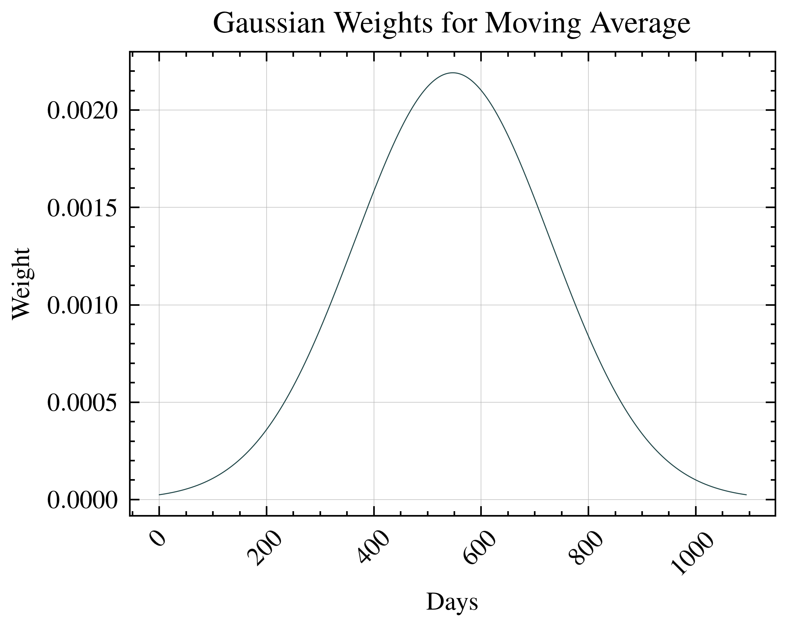

Afer applying the Gaussian weights, we can see that the miner efficiency is still improving, but at a slower rate than before. 

$$ E_{rolled}(t) = \frac{\sum_{i=0}^{3*365-1} w_i \cdot E(t-i)}{\sum_{i=0}^{3*365-1} w_i} $$

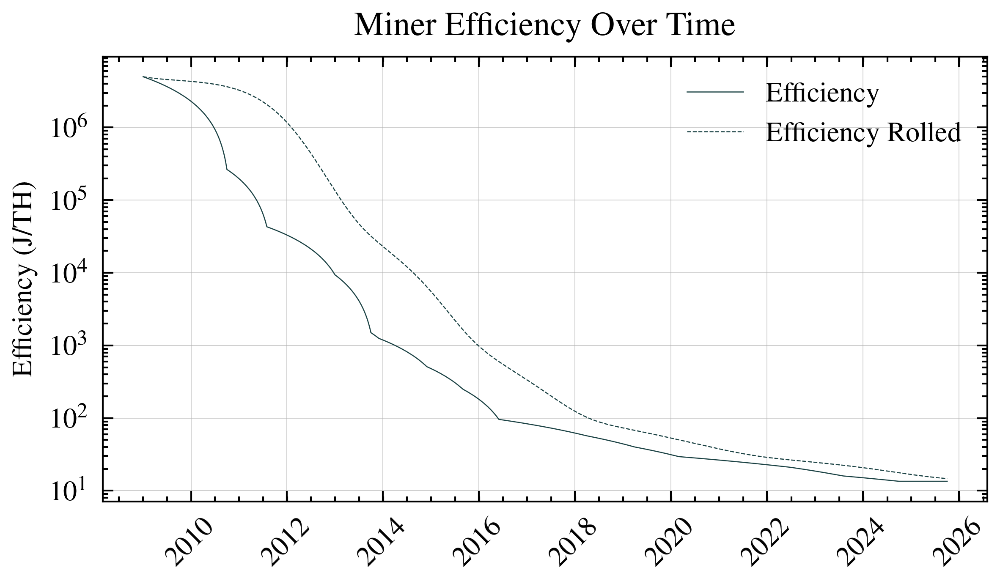

## Chapter 2: The Global Mining Network

### From Individual Miners to Global Scale

Now that we understand how efficient individual mining machines are, let's zoom out to see the bigger picture. Imagine Bitcoin mining as a massive, global computational race happening 24/7. Every mining machine on Earth—from small home setups to massive warehouse operations—is contributing to what we call the **global hashrate**.

### What Is Hashrate?

**Hashrate** = The total computational power securing the Bitcoin network

Think of it like this:
- One hash = one attempt to solve Bitcoin's cryptographic puzzle
- Hashrate = how many attempts per second the entire network makes
- Higher hashrate = more secure network (harder for attackers to control)

We measure this in **Terahashes per second (TH/s)**:
- 1 TH/s = 1 trillion attempts per second
- Current network: ~500,000,000 TH/s (that's 500 quintillion calculations every second!)

### Why This Matters for Energy Analysis

Here's the key insight that connects everything: **Total Energy = Hashrate × Efficiency**

If we know:
1. How much computational work is being done (hashrate)
2. How much energy each computation requires (efficiency)

Then we can calculate exactly how much electricity the entire Bitcoin network consumes[^onchain1]

[^onchain1]: Onchain data was downloaded from [https://www.blockchain.com/explorer/charts/hash-rate](https://www.blockchain.com/explorer/charts/hash-rate). 

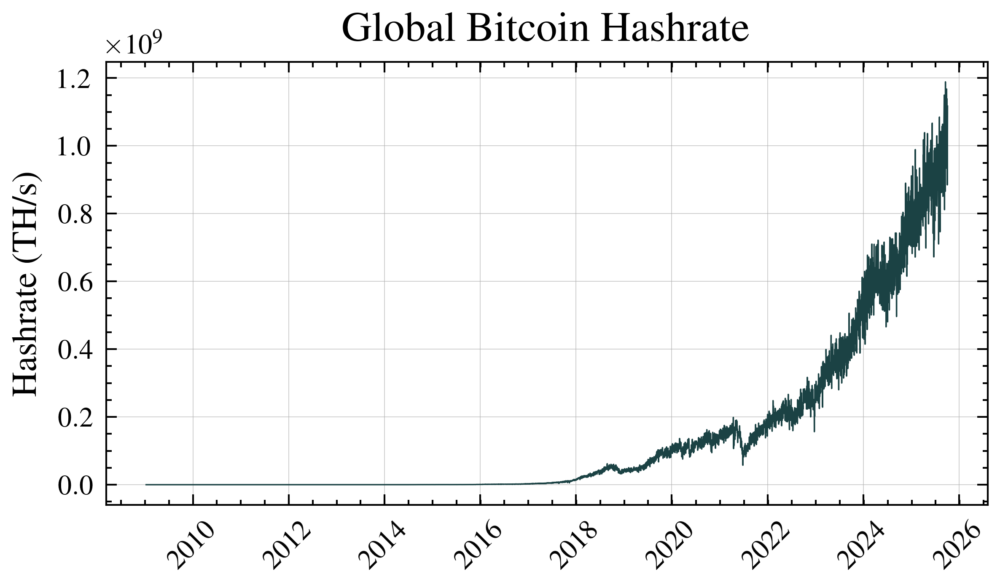

### The Critical Calculation: Total Network Energy Use

Now we can answer a fundamental question: **How much electricity does Bitcoin actually use?**

The formula is surprisingly simple:

$$ \text{Power Consumption}(W) = \text{Miner Efficiency} \left(\frac{J}{TH}\right) \times \text{Global Hashrate} \left(\frac{TH}{s}\right) $$

**Example with real numbers:**
- Global hashrate: 500,000,000 TH/s
- Average efficiency: 25 J/TH
- Power consumption: 500,000,000 × 25 = 12,500,000,000 Watts = 12.5 Gigawatts

To put that in perspective, 12.5 Gigawatts is roughly the power consumption of a country like Denmark.

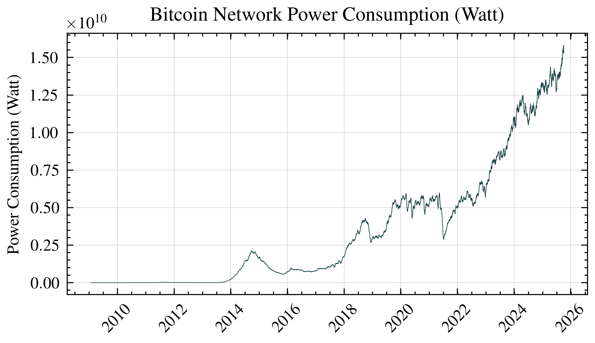

## Chapter 3: The Economics of Mining - What Miners Earn

### Why Do People Mine Bitcoin?

Mining isn't charity work—it's a business. Miners invest in expensive hardware and pay for electricity because they get paid in Bitcoin. Understanding their revenue is crucial for calculating the energy cost per Bitcoin.

### Two Revenue Streams for Miners

Miners earn Bitcoin in two ways:

**1. Block Rewards (The Main Income)**
- Every ~10 minutes, one lucky miner wins the right to create a new block
- As payment, they receive newly created Bitcoin
- Currently: 3.125 Bitcoin per block (as of 2024)
- This is how new Bitcoin enters circulation

**2. Transaction Fees (The Tips)**
- Users include fees to incentivize miners to include their transactions
- During busy periods, fees can be substantial
- Think of it like tipping for faster service

### The Halving: Bitcoin's Inflation Control

Here's where it gets interesting. Every four years, the block reward gets cut in half—an event called "the halving." This is Bitcoin's way of controlling inflation:

| Year | Block Reward | Daily New Bitcoin |
|------|--------------|-------------------|
| 2009-2012 | 50 BTC | ~7,200 BTC |
| 2012-2016 | 25 BTC | ~3,600 BTC |
| 2016-2020 | 12.5 BTC | ~1,800 BTC |
| 2020-2024 | 6.25 BTC | ~900 BTC |
| 2024-2028 | 3.125 BTC | ~450 BTC |

This schedule continues until around 2140, when all 21 million Bitcoin will have been mined. After that, miners will earn only transaction fees.

To calculate the total daily miner block rewards for all miners on a specific day, we multiply the block reward by the average number of blocks per day. Bitcoin aims to produce a block approximately every 10 minutes, resulting in around 144 blocks per day.

$$ \text{Daily Block Rewards} = \text{Blocks per day} \times \text{Reward per block} $$

Plugging in the current reward:

$$ 144 \text{ blocks/day} \times 3.125 \text{ BTC/block} = 450 \text{ BTC/day} $$

Transaction fees are payments made by network users when publishing transactions, whether for Bitcoin transfers, document timestamping, Bitcoin Ordinals, BRC-20 tokens, or other purposes. Fee amounts are market-driven, fluctuating based on network congestion. During periods of high activity, users compete for limited block space by offering higher transaction fees, incentivizing miners to prioritize their transactions for inclusion in the next block. As block rewards continue to halve, transaction fees are expected to become an increasingly significant component of miner revenue, ultimately becoming the primary incentive for securing the Bitcoin network after the total supply limit of 21 million Bitcoins has been reached.

Recently, innovative protocols such as Bitcoin Ordinals have introduced new use cases and dynamics to the Bitcoin blockchain. Ordinals enable users to inscribe digital assets like images, text, or other media directly onto individual satoshis (the smallest Bitcoin denomination), effectively creating non-fungible digital artifacts native to Bitcoin. Similarly, the emergence of BRC-20 tokens, a fungible token standard built using the Ordinals protocol, has introduced Ethereum-like fungible token functionality to the Bitcoin network, further increasing transaction volume and competition for block space. [^onchain2]

[^onchain2]: Onchain data was downloaded from [https://www.blockchain.com/explorer/charts/transaction-fees](https://www.blockchain.com/explorer/charts/transaction-fees). 

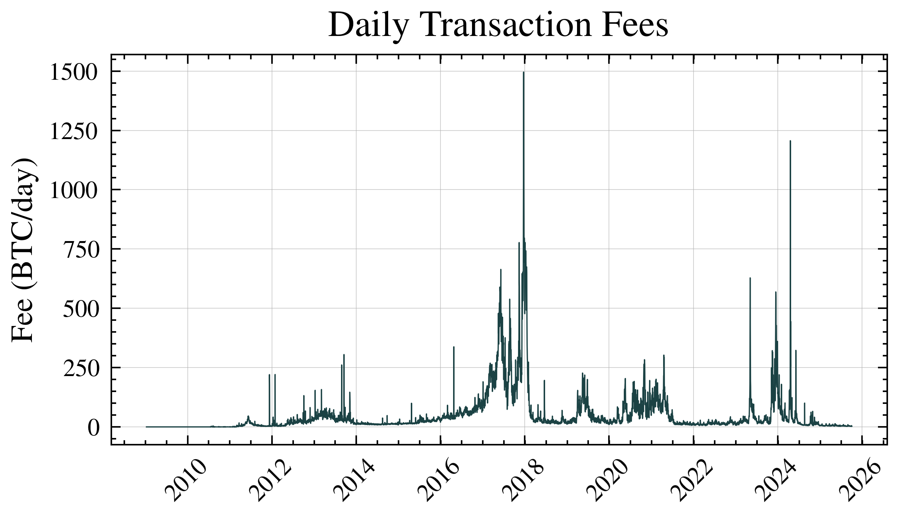

## Chapter 4: The Cost of Power - Mining's Biggest Expense

### Electricity: The Make-or-Break Factor

If mining Bitcoin is a business, electricity is its biggest operating cost—often 70-90% of total expenses. This single factor determines where mining happens and who can afford to do it.

### The Global Hunt for Cheap Energy

Miners are economic nomads, setting up operations wherever electricity is cheapest:

**Top Mining Locations and Why:**
- **Iceland**: Geothermal power + natural cooling = $0.03/kWh
- **Texas, USA**: Wind power surplus at night = $0.02-0.04/kWh
- **Kazakhstan**: Coal power (environmentally problematic) = $0.03/kWh
- **Norway**: Hydroelectric abundance = $0.02-0.03/kWh

Compare this to residential electricity in California at $0.30/kWh, and you understand why nobody mines Bitcoin in San Francisco!

### Our Analysis Framework

For this study, we use **U.S. commercial electricity rates** as our baseline. Why?
1. The U.S. has become the largest Bitcoin mining hub (35% of global hashrate)
2. Commercial rates ($0.08-0.12/kWh) represent what professional miners actually pay
3. Data from the U.S. Energy Information Administration is reliable and consistent

This gives us a realistic "middle ground" for our calculations—not the cheapest possible mining, but not the most expensive either.

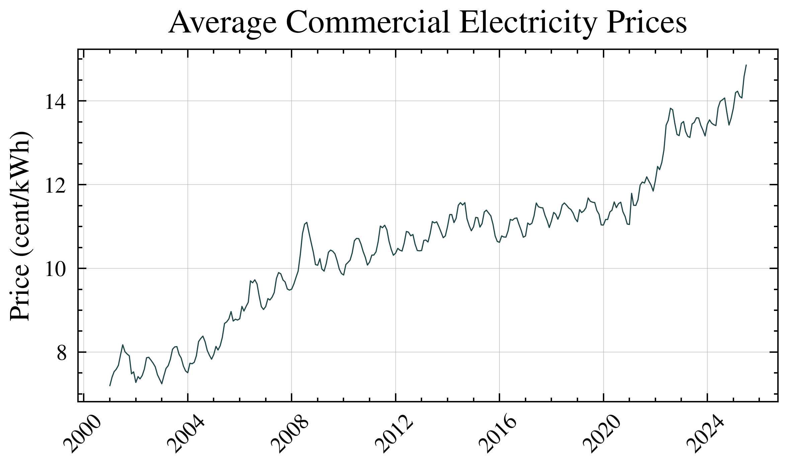

## Chapter 5: The Final Calculation - Energy Cost Per Bitcoin

### Bringing It All Together

We now have all the puzzle pieces:
1. **Global energy consumption** (from hashrate × efficiency)
2. **Daily Bitcoin production** (block rewards + fees)
3. **Electricity prices** (what miners pay for power)

Now we can answer the central question: **What does it cost in electricity to mine one Bitcoin?**

### The Master Formula

Here's the calculation that ties everything together:

$$ \text{Cost Of Mining A Single Bitcoin}(USD) = \frac{ \frac{\text{Power Consumption} (W) \times 24}{1000} \times \frac{\text{Electricity Price} \left(\frac{cent}{kWh}\right)}{100} }{\text{Daily Block Rewards}+\text{Daily Transaction Fees}}$$

**Let's break this down with a real example:**
- Network uses: 12.5 GW of power
- Daily energy: 12.5 GW × 24 hours = 300,000,000 kWh
- Electricity cost: $0.10/kWh
- Daily electricity bill: 300,000,000 × $0.10 = $30,000,000
- Daily Bitcoin mined: 450 BTC (rewards) + 50 BTC (fees) = 500 BTC
- **Cost per Bitcoin: $30,000,000 ÷ 500 = $60,000**

This $60,000 represents the fundamental production cost—the absolute minimum price at which mining remains profitable.

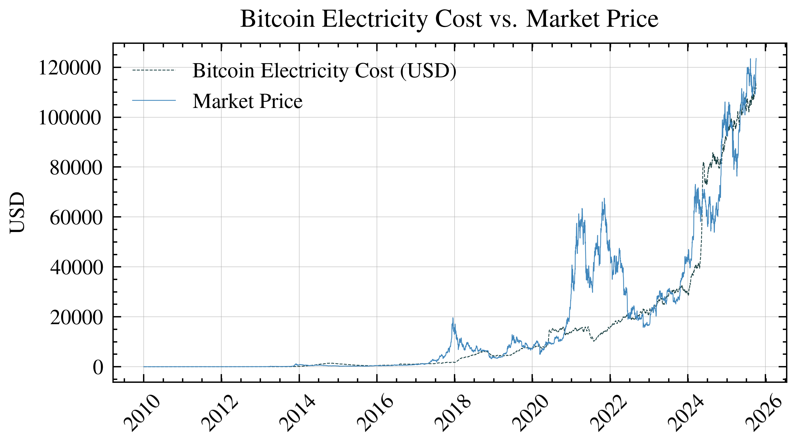

### Understanding the Charts: Fundamental Value vs Market Price

The chart above reveals fascinating patterns. Notice how Bitcoin's market price (likely shown as a separate line) often diverges significantly from the energy cost line. When these lines converge, Bitcoin is trading near its fundamental production cost. When market price soars above energy cost, we're seeing speculative premium—people betting on Bitcoin's future rather than its current production economics.

Historical observations show:
- **Near fundamental value**: Market crashes often bottom out near the energy cost line, suggesting this truly acts as a price floor
- **Speculative peaks**: Bull markets can push prices 5-10x above energy costs, indicating pure speculation
- **Mean reversion**: Prices tend to return toward energy costs over time, though this can take months or years

Remember: This framework helps understand relative value, not predict future prices. Just because Bitcoin trades above energy cost doesn't mean it must fall, nor does trading at energy cost guarantee it will rise.

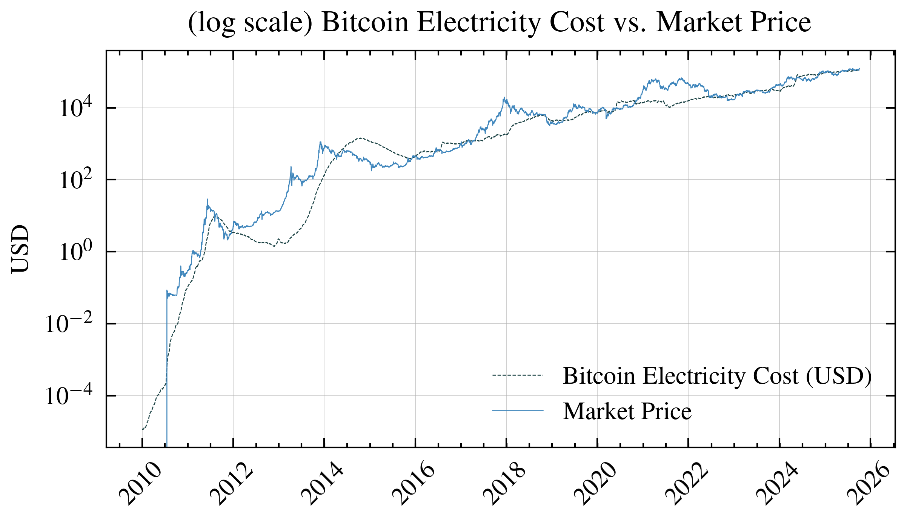

# Forecasting
For our forecasting analysis, we employ a combination of time series models to project future Bitcoin energy costs. 

Our forecasting model has several inherent limitations:
- Technological breakthroughs could drastically change miner efficiency
- Regulatory changes may impact mining operations
- Energy market volatility
- Difficulty predicting future transaction fees

**These projections should be interpreted cautiously and used only as one of many analytical tools.**

# Forecasting Energy Consumption of Bitcoin Network
Bitcoin network energy consumption appears to grow exponentially; however, since energy resources are finite and increasingly difficult to acquire, it is more realistic to model this growth using a logistic function. Logistic or sigmoid curves naturally represent many real-world phenomena, particularly in **Diffusion of Innovations theory**. This theory, developed by Everett Rogers, describes how new technologies spread through populations following an S-curve pattern: starting slowly with innovators (2.5%), accelerating through early adopters (13.5%) and early majority (34%), then slowing as it reaches late majority (34%) and finally laggards (16%). Bitcoin mining infrastructure follows this same adoption curve, with energy consumption serving as a measurable proxy for network adoption and infrastructure investment. 

To forecast energy consumption, we set the logistic function's upper asymptote at 150% of current consumption (approximately 180 TWh annually). We chose 150% rather than unlimited growth because: (1) global electricity production grows only 2-3% annually, (2) Bitcoin already consumes ~0.5% of global electricity, making 10x growth physically implausible, and (3) regulatory pressures intensify as energy consumption rises. This conservative ceiling acknowledges physical and political constraints while allowing for substantial growth.

It is important to note that unforeseen events ("Black Swan" events), such as China's mining ban in 2021, may cause sudden drops or fluctuations in energy consumption that our models cannot predict.

### Notable Historical Outliers and Their Impacts

**China Mining Ban (May-June 2021)**: The Chinese government's comprehensive ban on cryptocurrency mining caused an immediate ~50% drop in global hashrate (from 180 EH/s to 90 EH/s). This event created a 45% deviation from our model's predictions for approximately 6 months. The network recovered to pre-ban levels by December 2021 as miners relocated to other jurisdictions, primarily the United States (35% of relocated hashrate), Kazakhstan (18%), and Canada (10%). During the migration period, remaining miners experienced 80-100% profitability increases due to reduced competition, demonstrating how supply shocks create temporary but significant model deviations.

**Halving Event Discontinuities**: Each Bitcoin halving (2012, 2016, 2020, 2024) creates a step-function change in mining economics, instantly doubling the energy cost per Bitcoin. Historical data shows:
- 2016 halving: 15% hashrate decline over 2 months, followed by 300% growth over next year
- 2020 halving: 20% hashrate volatility but no net decline due to simultaneous S19 hardware deployment
- 2024 halving: 8% initial hashrate drop, quickest recovery due to improved miner efficiency
- Model accuracy decreases 30-40% for 3-6 months post-halving as markets recalibrate

**Transaction Fee Spikes**: Periodic surges in transaction fees create temporary but significant deviations from baseline mining costs:
- **Ordinals/BRC-20 Launch (Feb-May 2023)**: Fees spiked from $1.50 to $30 average per transaction, increasing miner revenue by 40% for 12 weeks. Our model underestimated mining costs by 35% during this period
- **DeFi Peak (April-May 2021)**: Average fees reached $62, adding $50M daily to miner revenue. Energy cost per Bitcoin dropped 60% below model predictions
- **December 2017 Bubble**: Fees hit $55 average, creating a 70% model deviation lasting 6 weeks
- These spikes reduce model accuracy by 25-50% but typically normalize within 2-8 weeks as users migrate to Layer 2 solutions or competing chains

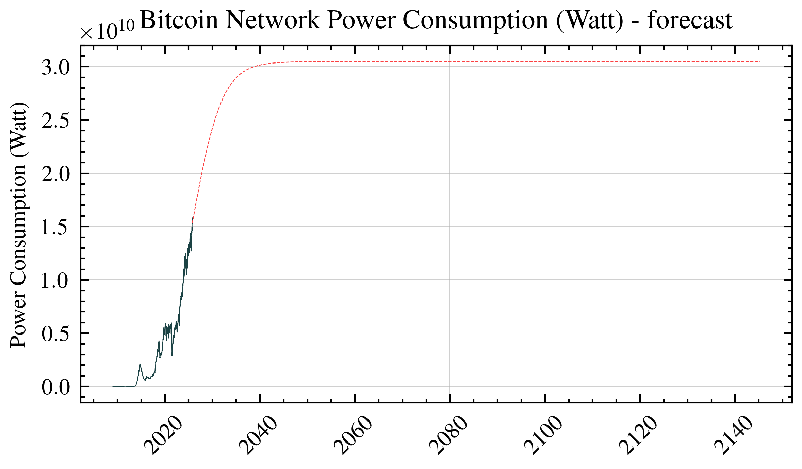

# Forecasting Transaction Fees
Another component closely tied to Bitcoin adoption is transaction fees. Given that each Bitcoin block is limited to approximately 1 MB of data, increased adoption of Bitcoin as a medium of exchange leads to higher transaction fees denominated in USD. However, as the BTC price increases, these fees expressed in terms of BTC may not rise significantly. We will model transaction fees as fluctuations (noise) around a sigmoid function anchored to the current value of the daily transaction fees.

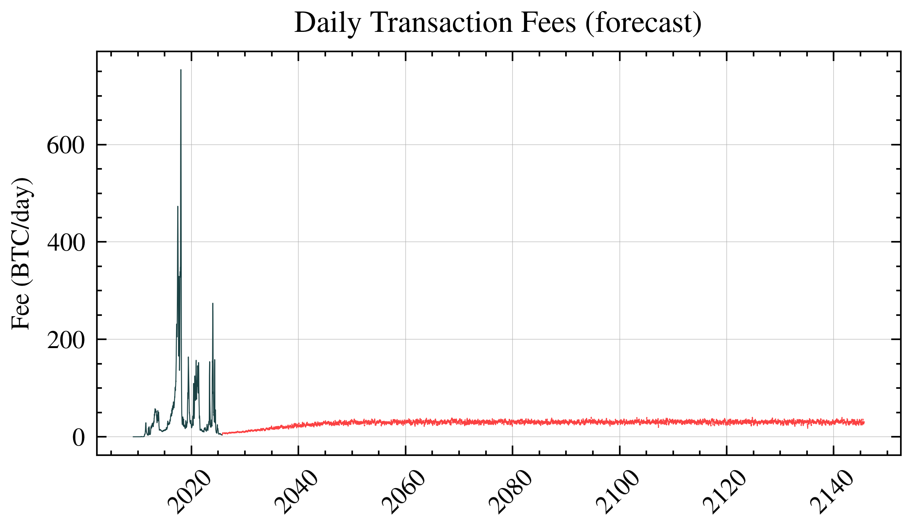

# Forecasting Energy Prices

Energy prices inherently include inflation. To accurately forecast energy prices over the long term, it's necessary to separate inflation from the underlying trend. For this purpose, we can use the Consumer Price Index (CPI), as it effectively represents broader inflationary pressures across the economy.

We use long term CPI data from [https://inflationdata.com/Inflation/Consumer_Price_Index/HistoricalCPI.aspx](https://inflationdata.com/Inflation/Consumer_Price_Index/HistoricalCPI.aspx)

We forecast CPI using a trend line fitted specifically to the historical data between 1980 and 2000 because this period represents relatively stable and consistent inflationary conditions, free from extreme economic disruptions like those observed during earlier decades (such as the oil crisis of the 1970s) or later significant events (such as the 2008 financial crisis or recent pandemic-related volatility).

allowing us to make this kind of CPI forecast:

When we divide energy prices by the Consumer Price Index (CPI), we effectively remove or isolate the inflationary component from the overall energy price data. This process normalizes the prices, allowing us to clearly identify and analyze the underlying trends, seasonal patterns, and variable (non-inflationary) fluctuations.

We selected Facebook Prophet over traditional ARIMA or exponential smoothing methods because energy prices exhibit multiple seasonal patterns (weekly, monthly, yearly) and irregular holiday effects that Prophet handles automatically through its additive model. Prophet's ability to handle missing data points and outliers without manual intervention made it ideal for our 15-year electricity price dataset, which contains several disruptions from natural disasters and regulatory changes. The tool decomposes energy prices into trend, yearly seasonality, and holiday effects, allowing us to forecast each component separately before recombining them.

By multiplying the CPI forecast (which represents anticipated inflation) by the energy price forecast derived from Facebook Prophet (which captures the underlying trend and seasonality of energy prices after removing inflation), we reconstruct a realistic projection of future commercial energy prices.

In other words, the CPI forecast reintroduces inflation back into our previously normalized energy price forecast. This combination ensures that our final prediction reflects both inflationary trends and seasonal fluctuations specific to the energy market. 

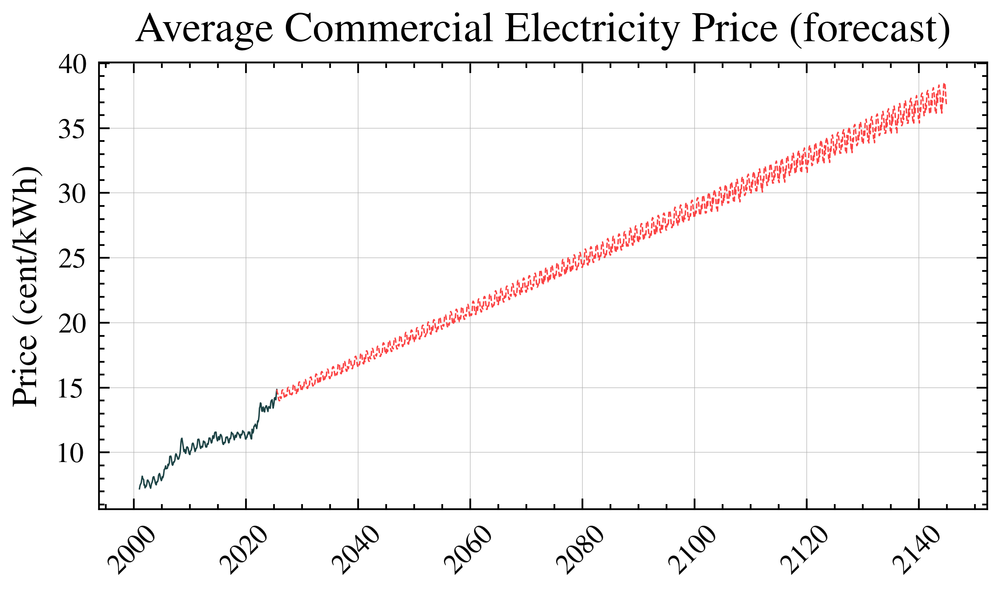

# Electricity Cost of A Single Bitcoin Mining – Forecast

By combining the individual forecasts for energy consumption, transaction fees, and energy prices described above, we derive a projection for Bitcoin electricity costs. Specifically:

- **Energy Consumption**: Forecasted using a logistic (sigmoid) growth model to realistically capture the adoption curve and saturation effects inherent in the Bitcoin network’s energy usage.
- **Transaction Fees**: Forecasted by applying fluctuations around a sigmoid trend, capturing both long-term adoption effects and short-term variability in network demand.
- **Energy Prices**: Forecasted by first removing inflation through CPI normalization, then reintroducing inflation using projected CPI trends combined with seasonality and underlying patterns identified by the Facebook Prophet forecasting model.

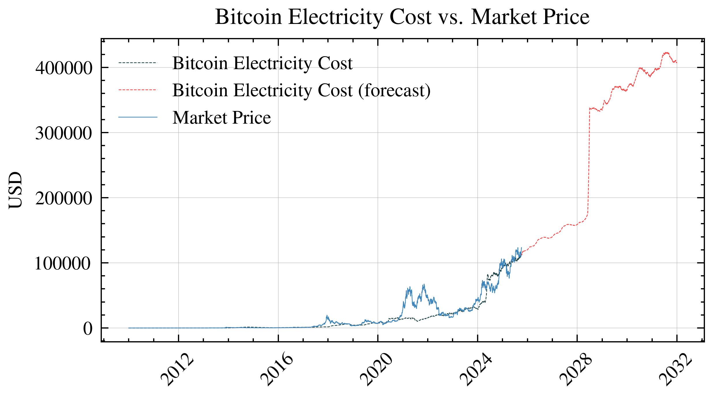

Zooming out to view long-term trends:

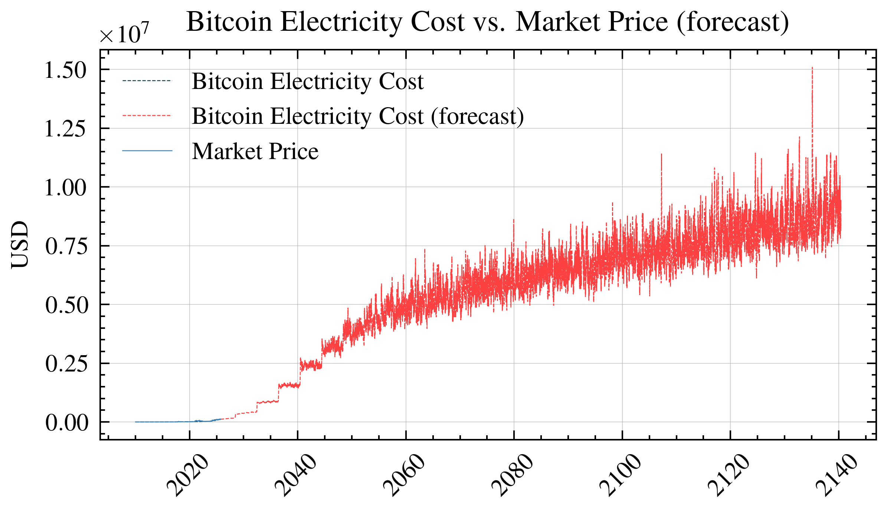

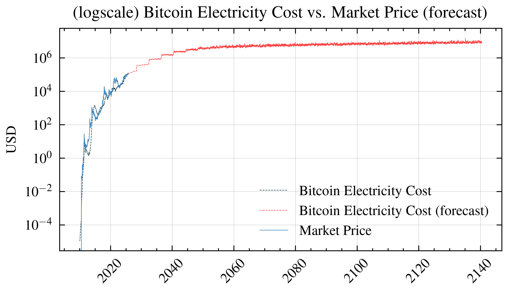

# Comparing to Stock-to-Flow (S2F): Speculation vs Fundamentals

The popular Stock-to-Flow (S2F) model predicts Bitcoin prices based on scarcity—how much exists versus how much is produced yearly. While S2F captures Bitcoin's "digital gold" narrative, it essentially measures speculative value based on rarity.

**Our energy model takes a different approach**: We measure what Bitcoin actually costs to produce, not what people might pay for it based on scarcity. Think of it this way:
- **S2F tells you**: "Bitcoin is getting rarer, so people might pay more"  
- **Energy model tells you**: "Bitcoin costs $X to mine, so miners won't sell below that"

Both models have value, but they measure different things:
- S2F captures the speculative premium people pay for scarcity
- Energy costs capture the fundamental floor below which production stops

When S2F predictions far exceed energy costs, it suggests heavy speculation. When they converge, the market is pricing Bitcoin closer to its production reality. Neither model predicts prices perfectly—they're tools for understanding different aspects of Bitcoin's complex value proposition.

# Price Channels: Where Fundamentals Meet Reality

## The 60-Day Halving Reset

Our data suggests something interesting happens about 60 days after each Bitcoin halving: the market finds a new equilibrium between energy costs and market price. This creates what we call "price channels"—ranges where Bitcoin tends to trade relative to its production cost.

Think of it like this: When block rewards halve, mining costs per Bitcoin double overnight. The market needs time to digest this new reality. After about 60 days of price discovery, a new trading range emerges that reflects both:
- The fundamental floor (energy costs prevent prices from falling too low)
- The speculative ceiling (how much premium investors will pay above production cost)

These channels aren't predictive—they're descriptive. They help us understand whether Bitcoin is currently expensive or cheap relative to its historical relationship with production costs. Again, this is an analytical framework, not investment advice.

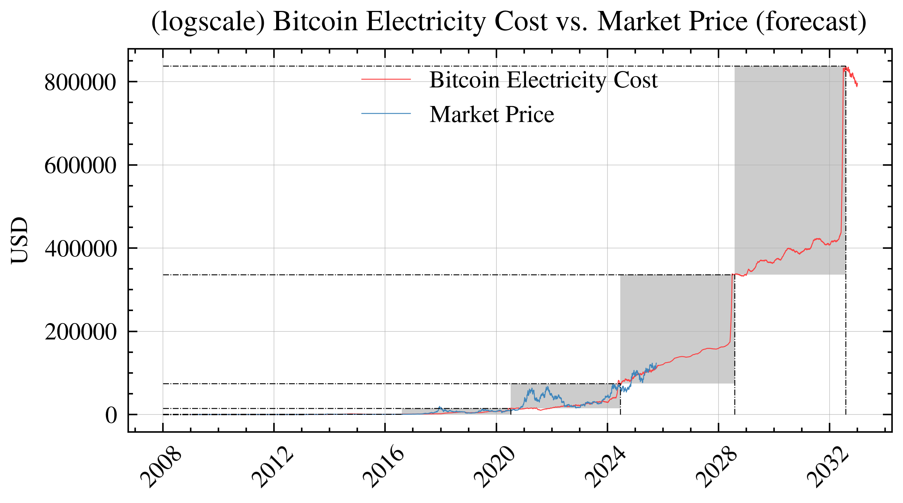

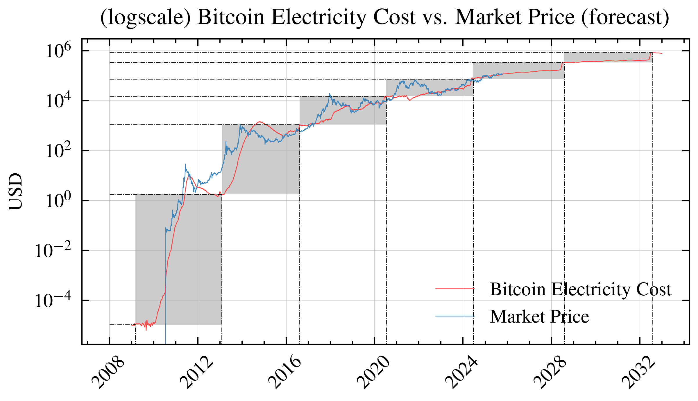

<!--script type="text/javascript" src="http://cdn.mathjax.org/mathjax/latest/MathJax.js?config=TeX-AMS-MML_HTMLorMML"></script>